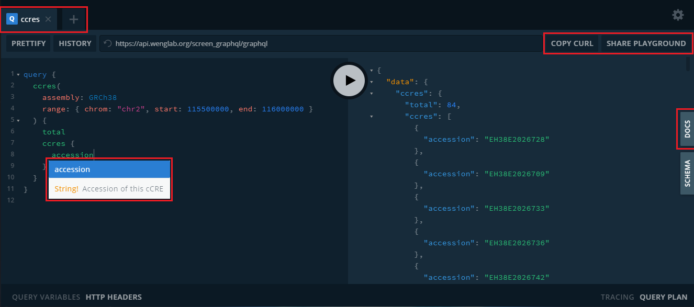

# SCREEN GraphQL API

The GraphQL API is the main way to programatically access SCREEN data and metadata.

## GraphQL

If you're unfamiliar with GraphQL, there are a myriad of resources. The
[GraphQL site](https://graphql.org/learn/) offers a detailed explanation of
GraphQL and how it works. However, for a (relatively) simple, one-page
introduction, [this page](https://www.howtographql.com/basics/2-core-concepts/)
is a good introduction.

## Getting started

The host url for the API is [`https://screen-api.wenglab.org/graphql`](https://api.wenglab.org/screen_graphql/graphql).

### Playground

Navigating to the host url directly in the browser gives an interactive
playground:

<a href="https://screen-api.wenglab.org/graphql" rel="noopener noreferrer" target="_blank">
    </img>
</a>

The playground gives autocompleted suggestions for queries, documentation (on
the right), tabs for multiple queries, a button to copy the current query as
a `cURL` call, and a button to share the current queries.

> The documentation tab in the playground is very powerful. You can find
> information on any type or field. You can browse the required arguments for
> queries that need them.

### Programmatic Access

In addition, the API can be accessed programatically.
[Many libraries](https://github.com/chentsulin/awesome-graphql) exists for
several languages in order to interface with GraphQL APIs. In this guide, we'll
briefly cover only three common, simple cases:

  * [Command-line with `cURL`](getting_started/command_line.md)
  * [Python with `requests`](getting_started/python.md)
  * [Javascript with `grapqhl-request`](getting_started/javascript.md)

## What is this guide?

This guide is intended to be a quick introduction to some of the various types
of data available in the SCREEN API. There will be several example queries, as
well as a quick exercise at the end of each section for interactivity. These may
require you to search through the documentation using the playground. To begin,
see the [queries overview](queries/overview.md).

## Composabiliy

The API is designed in a fashion that data is composable. For example, you can
query for nearby genes for a cCRE, and in the same request, also get the gene(s)
expression and intersecting SNPs. However, in some cases, we may return an error
if the respose would be too large or too performance-intenstive. In this case,
you can split your query into parts.
