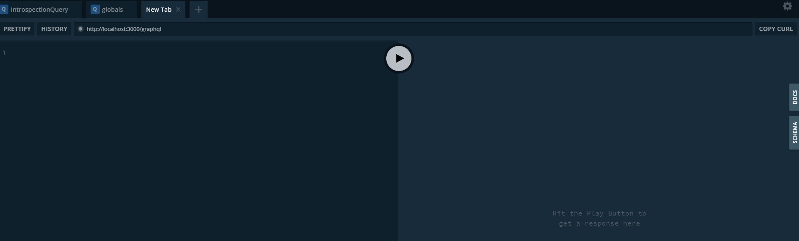

# SCREEN GraphQL API

The GraphQL API is the main way to programatically access SCREEN data and metadata.

## GraphQL

If you're unfamiliar with GraphQL, there are a myriad of resources. However, a
good place to start is the [GraphQL site](https://graphql.org/) itself.

## Getting started

The host url for the API is `screen-api.wenglab.org/graphql`.

### Playground

Navigating to the host url directly in the browser gives an interactive
playground:

<a href="https://screen-api.wenglab.org" rel="noopener noreferrer" target="_blank">
    </img>
</a>

The playground gives autocompleted suggestions for queries, documentation (on
the right), tabs for multiple queries, and a button to copy the current query as
a `cURL` call.

### Programmatic Access

In addition, the API can be accessed programatically.
[Many libraries](https://github.com/chentsulin/awesome-graphql) exists for
several languages in order to interface with GraphQL APIs. In this guide, we'll
briefly cover only three common, simple cases:

  * [Command-line with `cURL`](getting_started/command_line.md)
  * [Python with `requests`](getting_started/python.md)
  * [Javascript with `grapqhl-request`](getting_started/javascript.md)
